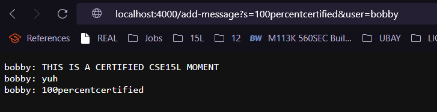
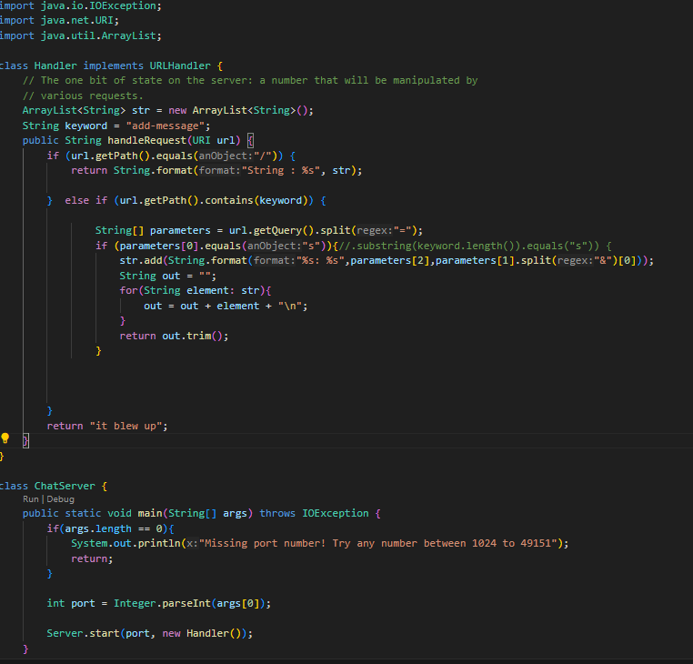
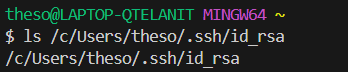
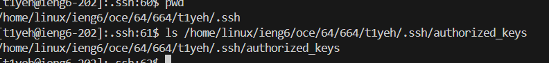
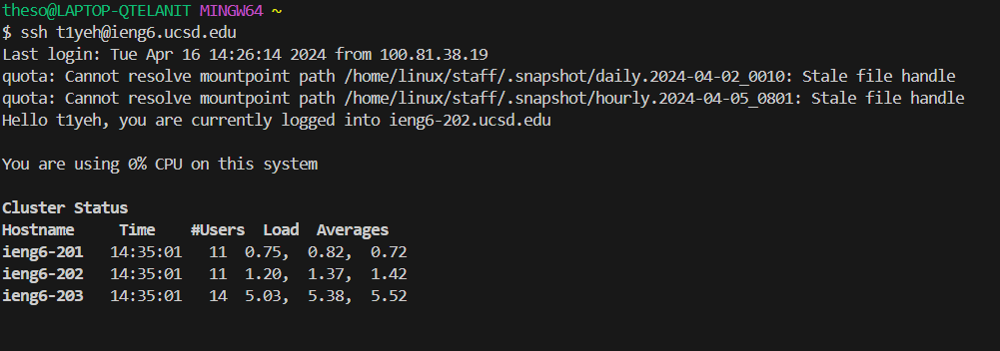

## Part 1
1.   
The method used in my Handler class(that is used in the main function of ChatServer) is called `handleRequest()`.  
The relevant arguments used in this function is a Url class named `url`, which is further analyzed through the URL class' `getQuery()` method in determining which keywords to search for and add User's input into an arrayList `str`(Which is also a relevant field) that is used to return a String `out` containing all of the contents within the arraylist.  
The values of these fields changes depending on the user input. for example, in this scenario the message to be added is "100percentcertified" and the user is called "bobby" the URL will differ depending on the input passed in the html code. `/add-message?s=100percentcertified&user=bobby`. The arraylist wills tore different values as a result, which will also cause the final `out` return to be different. However, changing the input does not change the keyword variable; it's just used for comparison, not for any changes in output.
2. .png)  
The method used in my class is called `handleRequest()` 
Similarly, the function takes in a Url class object called url to analyze relevant arguments. It employs the getQuery() method of the URL class to identify keywords for searching, adding user input to an arrayList str, and finally returning a String `out` containing all elements from the arrayList via a for loop.
The values of these fields changes depending on the html. In this scenario the message to be added is s="yuh" and the user is called user"bobby" 
the URL will differ depending on the input passed in the html code. `/add-message?s=yuh&user=bobby`. The resulting arraylist `str`, as well as the string output, `out` will differ from this input also. The String field `keyword` will remain the same because it is not edited for output -- purely used for comparing purposes.
3.   

## Part 2
1.   
2.    
3.   

## Part 3
On top of getting a refresher on last weeks search engine as well as bash commands such as cd and pwd, I learnt that -a is a way for me to show hidden files on the @ieng6 virtual directories, and how echo and scp can be used to write text/ or files into certain files or direcctories -- all of which are useful commands to know when accessing public and private keys. Additionally, I also learnt know how public nad private keys work together to authenticate a user into a virtual mamchine. 
